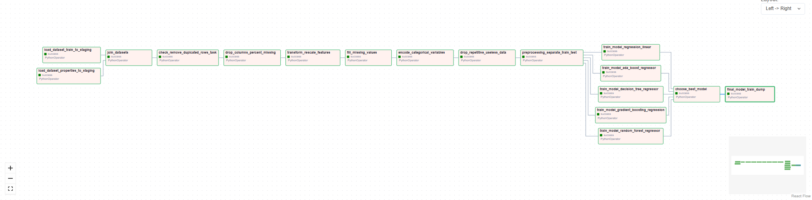

Nesta pasta foram realizadas as construções de pipelines utilizando o Airflow, buscando automatizar tarefas. Ao final foi criada uma pipeline onde foi realizada a automação de todas as etapas de um determinado projeto que têm como saída a melhor escolha de um modelo de Machine Learning. 🚀🤖

ENG: 
In this folder, we built pipelines using Airflow to automate tasks. In the end, we created a pipeline that automates all the steps of a specific project, resulting in the selection of the best Machine Learning model. 🚀🤖

